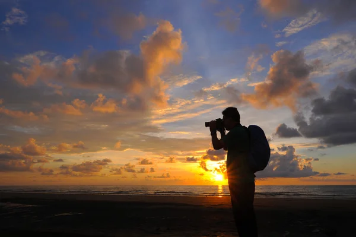

# Chanakya Thotakura

Photography is my favorite outdoor activity because it blends **creativity** with patient **observation**, helping capture fleeting light, textures, and candid moments. I love exploring new places at golden hour, experimenting with composition, and telling stories through images.

